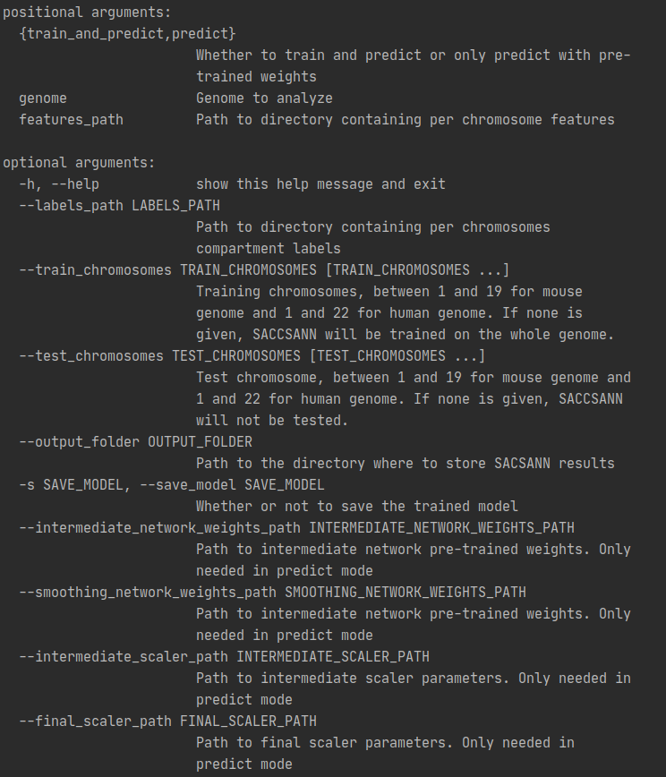

# SACSANN
Sequence-based predictor of chromosomal compartments


## Installation

To install SACSANN, follow these steps:

* Clone this repo
```bash
git clone https://github.com/BlanchetteLab/SACSANN
```

* Go to the right folder `cd SACSANN/`

* SACCSANN supports Python 3. The recommended way to use it is to create a virtual
 environment :
```bash
pyenv virtualenv 3.7.3 sacsann
pyenv local sacsann
```
* Then run `make install` to install the requirements

## Run the demo

You can run a demo of SACSANN on two mouse chromosomes by running `make run-demo`

For more information on available options, run :
```
python sacssann.py --help
```



## Input

* Expected input features should be stored in a csv file, with one file per chromosome
to analyze.
Each row of the csv corresponds to a bin and each column to a feature. Possible
features include GC content, count of transcription factors binding sites or
transposable elements counts.

* For training, binary labels should also be in csv files with one row per bin and
 one file per chromosome.
 Binary labels are interpreted as follows :
  - 0: bin included in a B compartment
  - 1: bin included in an A compartment
 

## Output

* Predicted compartments for the input tests chromosomes can be found in the
 specified output folder (default is `output/`), with one file per chromosome
 
* If the `save_model` argument is set to `True`, used models weights and
 parameters will be saved in pickle format in the following files:
  - `mlp_int_weights.p`
  - `scaler.p`
  - `mlp_top_weights.p`
  - `final_scaler.p`

## License
SACSANN is free software: you can redistribute it and/or modify it under the terms of
the GNU Lesser General Public License as published by the Free Software Foundation.

SACSANN is distributed in the hopes that it will be useful, but WITHOUT ANY WARRANTY; 
without even the implied warranty of MERCHANTABILITY or FITNESS FOR A PARTICULAR PURPOSE. 
See the GNU Lesser General Public License for more details.
